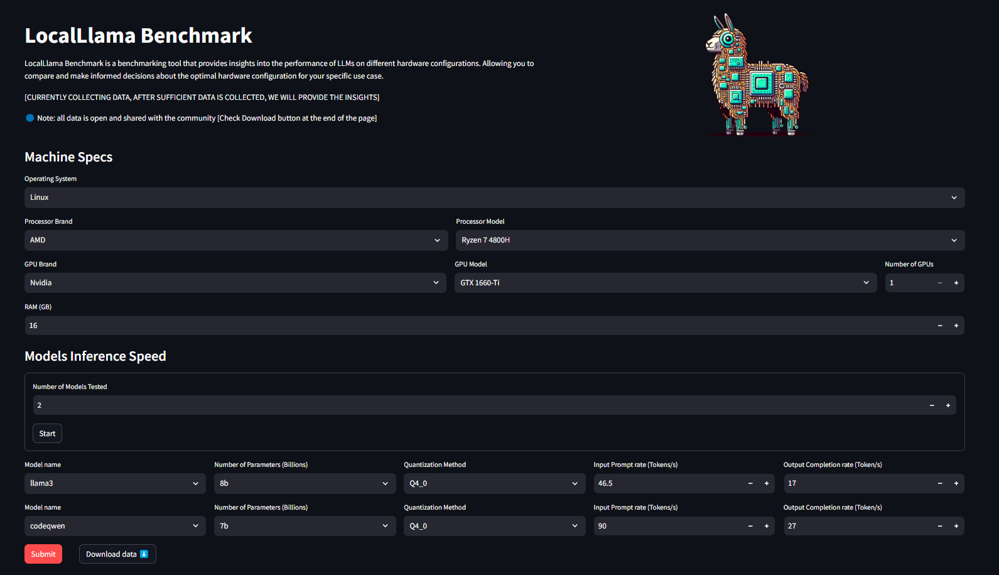
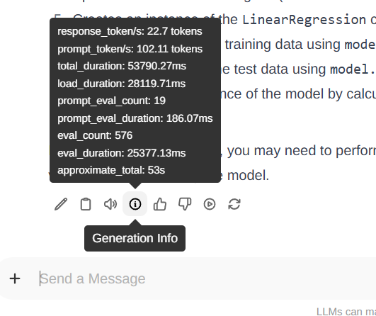

<div align = "center">

<br>
<h1>LocalLlama Benchmark </h1>
LocalLlama Benchmark is a benchmarking tool that provides insights into the performance of LLMs on different hardware configurations. Allowing you to compare and make informed decisions about the optimal hardware configuration for your specific use case.

<br>
<br>

[](https://huggingface.co/spaces/0ssamaak0/LocalLlama-Benchmark)

</div>
<br>



# How to use
- Fill your Machine Specs.
- Enter the number of models you have tested.
- Select model data, then enter input / output token rates.

Note: If you're using Ollama, default quantization method is `Q4_0`. don't change it.

## How to get the token rate
### llama.cpp
```
llama_print_timings:        load time =    1645.56 ms
llama_print_timings:      sample time =      10.93 ms /   225 runs   (    0.05 ms per token, 20589.31 tokens per second)
llama_print_timings: prompt eval time =      81.13 ms /     5 tokens (   16.23 ms per token,    61.63 tokens per second) ➡️ Input rate
llama_print_timings:        eval time =    8049.44 ms /   224 runs   (   35.94 ms per token,    27.83 tokens per second) ➡️ Output rate
llama_print_timings:       total time =    8224.06 ms /   229 tokens
```
### Ollama CLI
```
ollama run llama3:8b --verbose
>>> Prompt
answer .................

total duration:       31.038107091s
load duration:        1.067494ms
prompt eval count:    18 token(s)
prompt eval duration: 389.95ms
prompt eval rate:     46.16 tokens/s ➡️ Input rate
eval count:           520 token(s)
eval duration:        30.490567s
eval rate:            17.05 tokens/s ➡️ Output rate
```

### OpenwebUU



# Todo
- [ ] Extend support for more formats other than GGUF.
- [ ] Add Visualizations and comparison tools.
- [ ] Automatically fetch token rates from CLI-run models

# Resources
- [CPU & GPUs from UserBenchmark](https://www.userbenchmark.com/page/developer) + Apple Silicon Added Manually
- [Ollama-Models for models list](https://github.com/akazwz/ollama-models)